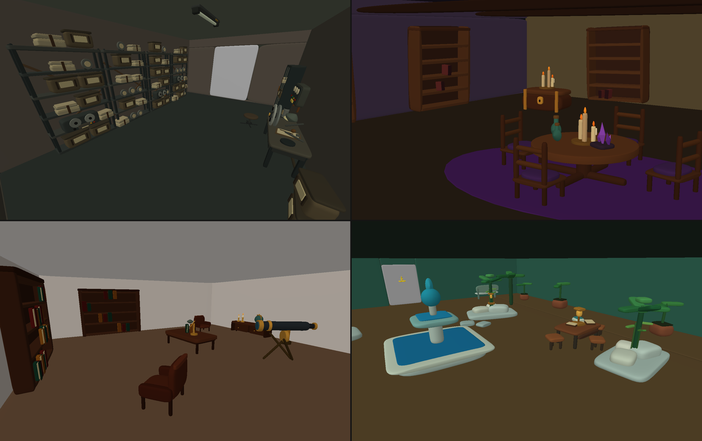
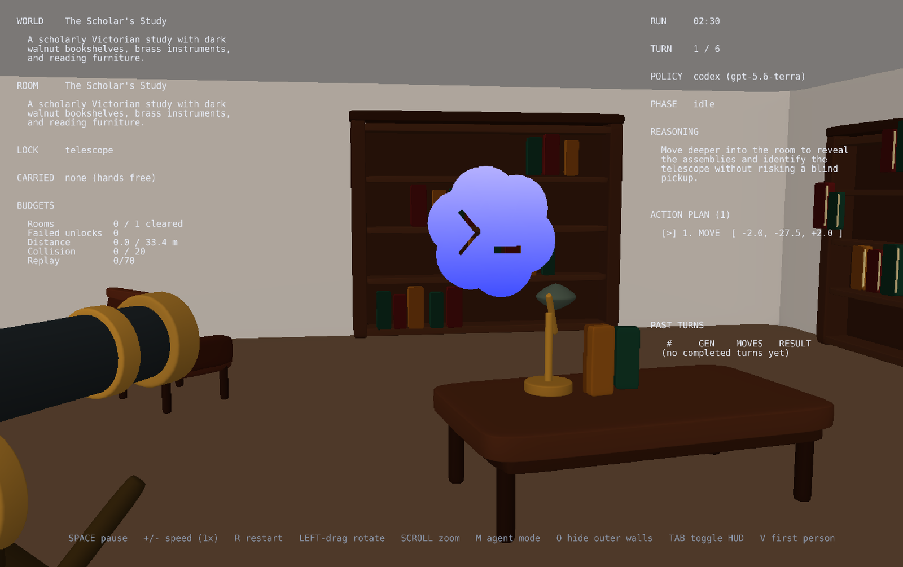

<h1 align="center">Superquadria: Generating and Navigating 3D Environments with Agents</h1>

> An agent harness that **builds a 3D world** and then **plays it**, using only text prompts.

https://github.com/user-attachments/assets/251657ec-7505-4604-8c4d-1fc6dd699a5e

The world is made of rooms, connected in a feed-forward fashion (from a start room, one way toward a final room). Each room has its own theme, kept coherent with the others so the world reads as a single, consistent environment. The doors between rooms are initially locked. The goal of the agent is to find an object that unlocks the door, pick it up, place it on the door, and proceed. The more rooms the agent clears before running out of budget (collisions, calls, runtime), the higher the score.

We chose this room-centric scenario because an open world can, in practice, be reduced to a set of rooms: an open space is just a room with no walls, connected via invisible doors spanning its entire perimeter to the rest of the environments in the world (which are themselves just other rooms). Once the harness can reliably generate themed rooms, generalizing to open-world and more complex scenarios becomes straightforward: the atomic unit of generation stays a single space (a room) with a consistent theme, whether a forest, a space station, a parking lot, or anything else.

The engine is divided into two parts, both agent-driven and taking only text input. Remarkably, **no vision** is used even though we are navigating a complex and **expressive 3D environment**. To accomplish this, we based the 3D world on a parametric yet very expressive geometric primitive: the superquadric. Each object in the scene is an assembly of superquadrics: the generation agent produces superquadric parameters, and the navigation agent consumes superquadric parameters. In this way, we achieve expressive, lightweight, and efficient 3D generation and navigation from text-only commands.

### Generation

World generation is a two-step flow:

- A first agent generates the **overall layout** of the world, from a user prompt which provides arbitrary details on the environment, and constraints such as the max number of rooms, number of objects per room, etc.
- Then, **each room** is furnished **in parallel** by a set of agents that take the brief and instructions and produce the actual shapes.

After the engine checks for collisions, out-of-bounds placement, etc., the 3D world is rendered and ready to be played.


<p align="center"><em>Examples of generated worlds.</em></p>

### Navigation

The agent starts in the first room, with everything in front of it visible (i.e., visible shape parameters are listed in the navigation prompt). It is told the shape of the key it needs to find. It freely explores the room, picking up and placing objects, until it finds the key, places it on the door, and unlocks it. Once done, it proceeds to the next room and the process repeats. The game ends when the agent clears all rooms or reaches the maximum number of collisions or calls.


<p align="center"><em>Codex navigating a generated world.</em></p>

## Usage

The engine drives an interactive window where the world is rendered and the policy animated.

**Requirements:** `codex` (or `claude`) CLI downloaded and authenticated.

### Quickstart

```bash
uv sync                              # Python >=3.12

python -m engine run                 # agent generates, agent navigates
python -m engine generate            # agent generates world
python -m engine play                # play a saved world under worlds/
python -m engine replay              # re-watch a saved episode
```

We ship 3 example episodes across 3 different worlds under [`episodes/`](./episodes/) and [`worlds/`](./worlds/), so `play` and `replay` work immediately without generating anything first.

### Configuration

The CLI is minimal by design. Agent settings, world bounds, episode budgets, and policy type (agent-driven, manual play) live in [`configs/config.yaml`](./configs/config.yaml).

The engine supports both Codex and Claude Code. We recommend Codex (see [Discussion](#discussion) for why). Set the agent from the config:
```yaml
defaults:
  - agent: codex    # or: claude
```
Agent-specific settings can be specified in [`configs/agent/codex.yaml`](./configs/agent/codex.yaml), e.g., binary, model, effort.

### Watching Agents Live

All agents run inside a single persistent `tmux` session with one window per step (`layout`, `room1`, `room2`, ..., `player`). Attach directly from the terminal to inspect exactly what's happening: what the agent is receiving as input, how it's reasoning, and what it's returning as output.

The harness logs the attach command when it spawns a window; paste it into another terminal to watch that agent live:
```bash
tmux attach -f ignore-size -t superquadria:layout
```

### Manual Play

`policy: manual` flies the same scene with keyboard + mouse controls, so you can play a generated world.

## Discussion

Overall, the engine works well: generated worlds are realistic and coherent, and navigation is nice to watch play out. Below we discuss a few non-trivial observations along the way.

### Codex vs. Claude Code

Extensive experiments show Codex outperforms Claude Code at both world generation and navigation in speed, token usage, and quality. During navigation, Codex uses an average of 3.4 actions per call (move, pick, or place), even though the limit is 8.

### Hierarchical Generation

One-shot generation of the entire world is too heavy: it overloads the agent and gets it lost.

Splitting generation into two steps instead keeps each agent focused, and is required for quality and realism, not just speed:

1. **Layout first:** a single agent lays out the world, establishing coherent structure and theme before any room is furnished.
2. **Rooms in local frame:** each room agent then generates its objects in a local frame and places them into the scene (position, scale, rotation), rather than emitting absolute world coordinates directly.

Working in a local frame is also what makes objects reusable across rooms, and keeps geometry correct. Placing every part in absolute world coordinates would be far harder for the agent to get right.

### Runtime

Runtimes for the Codex models (generation quality visibly improves with more capable models):

| Model | Effort | Layout generation | Room generation | Move generation (batch) |
| --- | --- | --- | --- | --- |
| GPT-5.6-Sol | High | 30-40s | 4-5min | 15-45s |
| GPT-5.6-Terra | High | 15-20s | 1-2min | 15-45s |
| GPT-5.6-Luna | High | 15-20s | 3-4min | 15-45s |

### 2D-First Development

The agent loop, `tmux` dispatch, and many other parts of the architecture were first built and validated in a 2D harness, which was cheaper and faster to iterate on than the full 3D pipeline. Once that loop was solid, we moved to the 3D harness described in this README. The 2D harness and its experiments are kept in [`archive/`](./archive/) for reference.

## Future Work

A few directions we ruled out for this first version, but which are the obvious next steps:

- **Whole-world interaction:** make room history matter and previous rooms useful, so the agent actually navigates the whole world instead of moving through it one-way, e.g., the last room could require an element from the very first, forcing the agent to remember everything and navigate back.
- **Infinite generation:** the layout is already structured to generalize naturally to infinite world generation. The layout agent can be re-invoked, taking the current layout (or just a subset of it) as input, to generate extensions, with parallel room agents then populating the new rooms. This can run in the background while the navigation agent explores, effectively producing an infinite environment. Rooms could also have multiple doors, letting the agent decide which one to open and generating new rooms on demand as it explores.
- **Open world:** expand beyond room-based layouts, e.g., to actual cities or open-world outdoor environments. In practice, an outdoor environment can be modeled as simply a large room with no walls.

## Acknowledgements

We use [Ursina](https://www.ursinaengine.org/) as the game engine, [Codex](https://openai.com/codex/) as the generation/navigation agent, and [Claude Code](https://claude.com/product/claude-code) and [Antigravity CLI](https://antigravity.google/product/antigravity-cli) as coding agents for development.
